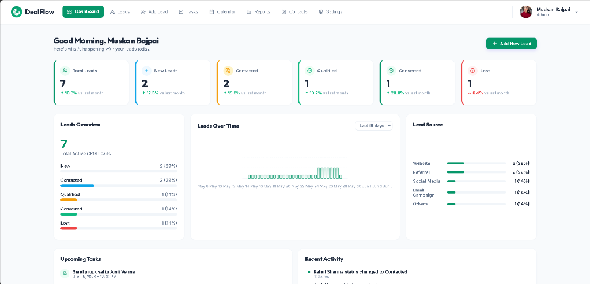
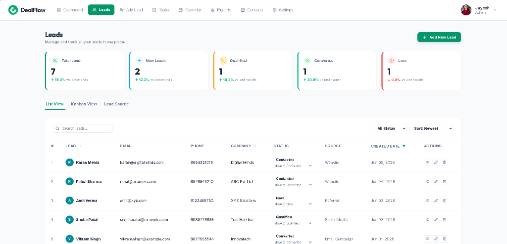
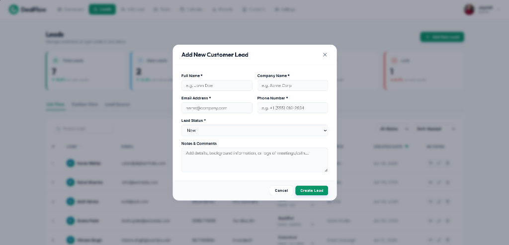
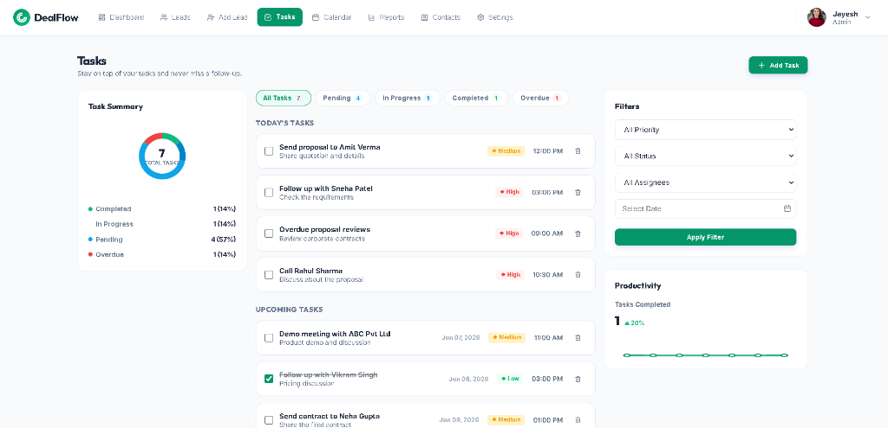
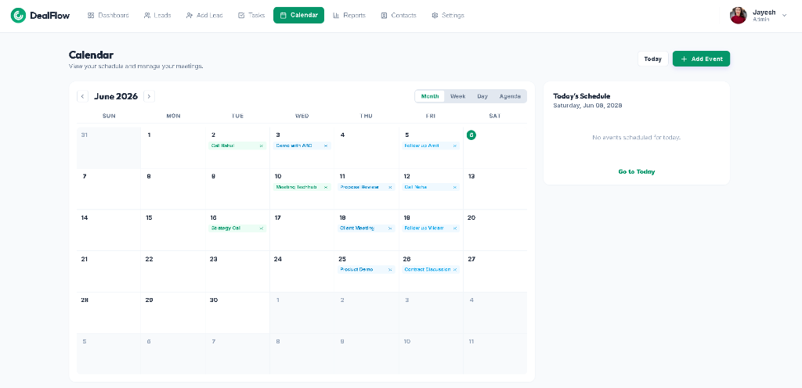
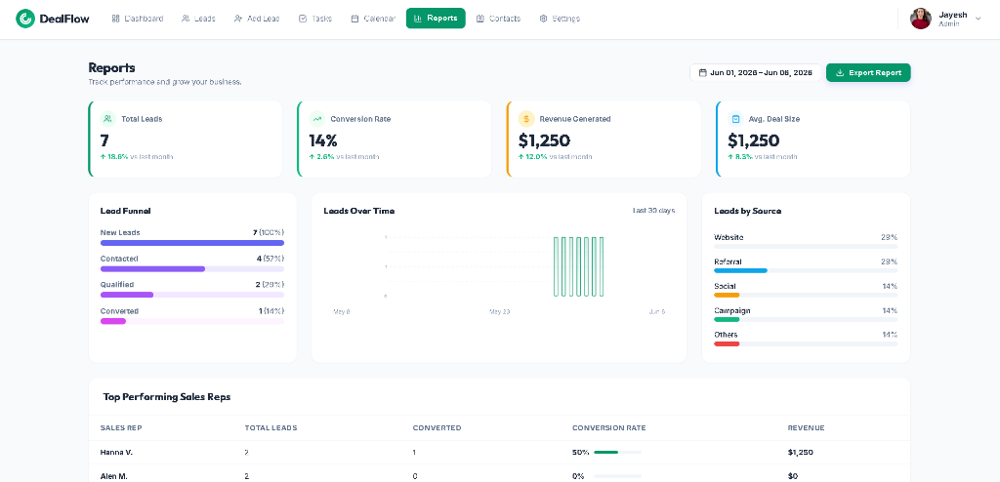
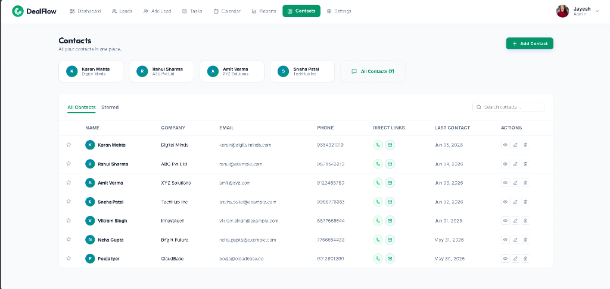

# DealFlow - Premium Lead Management CRM and Pipeline Dashboard

DealFlow is a modern, professional, and highly interactive full-stack Customer Relationship Management (CRM) platform designed for businesses to track, qualify, and convert potential customers. It features a streamlined horizontal top navigation bar, a premium Emerald Green and Slate color theme, vertical column charts for analytics, and responsive boards for tasks and schedules.

---

## Interface and Screenshots

### 1. Dashboard View
The central workspace featuring live KPI metrics (Total Leads, New, Contacted, Qualified, Converted, Lost), a 30-day leads column chart, horizontal progress bars for lead status and acquisition channels, upcoming tasks list, and recent activity logs.


### 2. Leads Management
A clean, paginated table view supporting instant search queries, status filters, sorting options, and view switches (List, Kanban, and Lead Source).


### 3. Add and Edit Lead Dialog
A structured modal interface to register new leads or update existing contact details, company information, status, and manual notes.


### 4. Tasks Manager
A Kanban-style todo board to schedule follow-ups, assign priorities (High, Medium, Low), and track completed vs pending actions.


### 5. Calendar Scheduler
A monthly planner to schedule and coordinate client meetings, calls, and project deadlines across specific dates.


### 6. Reports and Analytics
A dedicated analytics view displaying overall pipeline statistics, sales representative performance, lead distribution by acquisition source (Website, Referral, Social Media, Email Campaign), and monthly acquisition trend charts.


### 7. Contacts Directory
A direct contacts list presenting clean user profiles, search tools, starred selections, and active click-to-call or click-to-email options to communicate with clients instantly.


---

## Technical Stack and Architecture

### 1. Frontend
* React 18
* Vite
* Vanilla CSS (responsive grid layout, Slate base theme, Emerald green accents)
* Lucide React Icons

### 2. Backend
* Node.js and Express MVC architecture
* RESTful API endpoints for Leads, Tasks, Events, and Activities

### 3. Database
* MongoDB Community Server
* Mongoose ODM (Object Document Mapper) for schema validation

---

## Directory Structure

```
DealFlow/
├── images/                  # Screenshots of application views
│   ├── dashboard_v2.png
│   ├── leads_v2.png
│   ├── add_lead_v2.png
│   ├── tasks_v2.png
│   ├── calendar_v2.png
│   ├── reports_v2.png
│   └── contacts_v2.png
├── backend/                 # Node.js + Express backend service
│   ├── config/              # MongoDB database configuration
│   ├── controllers/         # MVC controller business logic
│   ├── models/              # Schema definitions (Lead, Event, Task, Activity)
│   ├── routes/              # Express Router endpoints
│   ├── .env                 # Environment configurations
│   ├── seed.js              # Database populator seed script
│   └── server.js            # Express application entry point
├── frontend/                # Vite + React frontend service
│   ├── public/              # Static files
│   ├── src/                 # React source files
│   │   ├── components/      # UI Views (Dashboard, LeadsView, TasksView, CalendarView, ReportsView, ContactsView, SettingsView, LeadModal)
│   │   ├── utils/           # Backend API call handlers
│   │   ├── App.jsx          # Navigation state and root layout
│   │   ├── index.css        # Central stylesheet and layout grid system
│   │   └── main.jsx         # App mounting entry point
│   ├── index.html           # HTML container template
│   ├── package.json         # Frontend packages and dependencies
│   └── vite.config.js       # Vite configuration file
└── .gitignore               # Git exclude rules
```

---

## Step-by-Step Local Setup Guide

### Prerequisites
* Node.js (v18.0.0 or higher) installed on your system.
* MongoDB Community Server running locally on the default port (27017).

### Step 1: Clone or Open the Repository
Clone the project to your local drive:
```bash
git clone https://github.com/MuskanBajpai/DealFlow.git
cd DealFlow
```

### Step 2: Configure the Backend Environment
1. Navigate to the backend folder:
   ```bash
   cd backend
   ```
2. Install the backend dependencies:
   ```bash
   npm install
   ```
3. Create a `.env` file in the root of the `backend` folder and define your variables:
   ```env
   PORT=5000
   MONGODB_URI=mongodb://localhost:27017/leadpro
   NODE_ENV=development
   ```

### Step 3: Seed the Database
Populate your local MongoDB instance with initial mock database entries (leads, tasks, events, activities):
```bash
npm run seed
```

### Step 4: Run the Backend Server
Start the Express server using nodemon:
```bash
npm run dev
```
The console will display:
* `Server running in development mode on port 5000`
* `MongoDB Connected: localhost`

### Step 5: Configure and Run the Frontend
1. Open a new terminal window and navigate to the frontend folder:
   ```bash
   cd ../frontend
   ```
2. Install the frontend dependencies:
   ```bash
   npm install
   ```
3. Start the Vite React development server:
   ```bash
   npm run dev
   ```
4. Open your browser and navigate to: **`http://localhost:5173/`**

---

## Production Deployment Guide

Follow these steps to host your database, API server, and web application in production.

### Phase 1: Set Up MongoDB Atlas (Cloud Database)
MongoDB Atlas offers a free tier (M0) perfect for production hosting.
1. Log in to your MongoDB Atlas account and create a new project named `DealFlow`.
2. Click Build a Database, select the M0 Free tier, and choose your preferred cloud provider and regional location.
3. Under Database Access, create a database user with a secure password and save the credentials.
4. Under Network Access, add IP Address `0.0.0.0/0` (Allow Access from Anywhere) to permit connections from your cloud-hosted backend.
5. Retrieve your connection string. It will look like this:
   `mongodb+srv://<username>:<password>@cluster0.abcde.mongodb.net/?retryWrites=true&w=majority`
   Replace `<password>` with the password you created for the database user.

### Phase 2: Deploy the Backend (Render)
1. Log in to Render and select New > Web Service.
2. Connect your GitHub repository: `https://github.com/MuskanBajpai/DealFlow.git`.
3. Configure the Web Service settings:
   * Name: `dealflow-backend`
   * Root Directory: `backend`
   * Runtime: `Node`
   * Build Command: `npm install`
   * Start Command: `npm start`
4. Add the following Environment Variables in the Advanced section:
   * `MONGODB_URI` = (Your MongoDB Atlas connection URI string)
   * `PORT` = `10000`
   * `NODE_ENV` = `production`
5. Click Create Web Service. Once deployment completes, copy the generated service URL (e.g., `https://dealflow-backend.onrender.com`).

### Phase 3: Deploy the Frontend (Render or Vercel)
1. On Render, select New > Static Site. (On Vercel, select Import Project).
2. Connect your GitHub repository: `https://github.com/MuskanBajpai/DealFlow.git`.
3. Configure the frontend settings:
   * Name: `dealflow-frontend`
   * Root Directory: `frontend`
   * Build Command: `npm run build`
   * Publish Directory: `dist`
4. Add the following Environment Variable:
   * `VITE_API_URL` = (Your Backend live URL, e.g., `https://dealflow-backend.onrender.com`)
5. Click Create Static Site. Once compilation finishes, copy your live frontend URL.

### Phase 4: Finalize Backend CORS Configuration
1. Go to your Render Dashboard and open the `dealflow-backend` Web Service.
2. Select Environment from the side menu.
3. Locate or add the environment variable `FRONTEND_URL` and set its value to your live frontend URL (e.g., `https://dealflow-frontend.onrender.com`).
4. Save the changes. The backend will redeploy automatically with CORS security configured.
