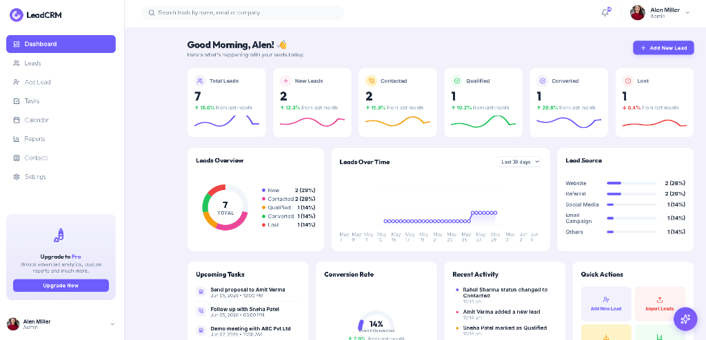
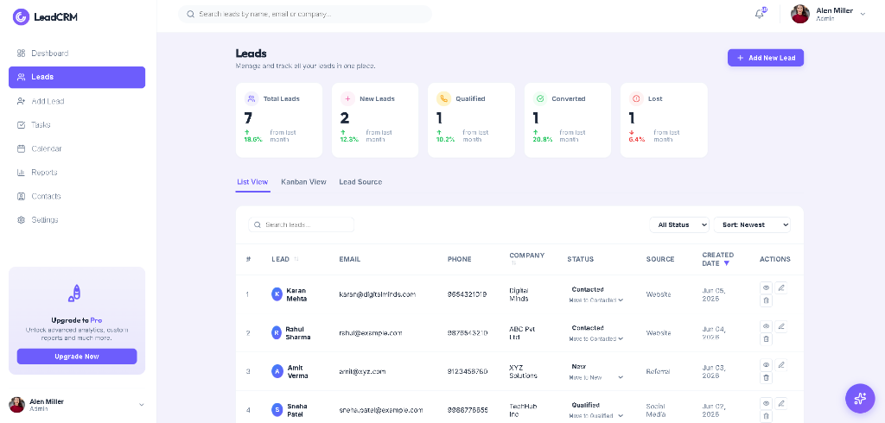
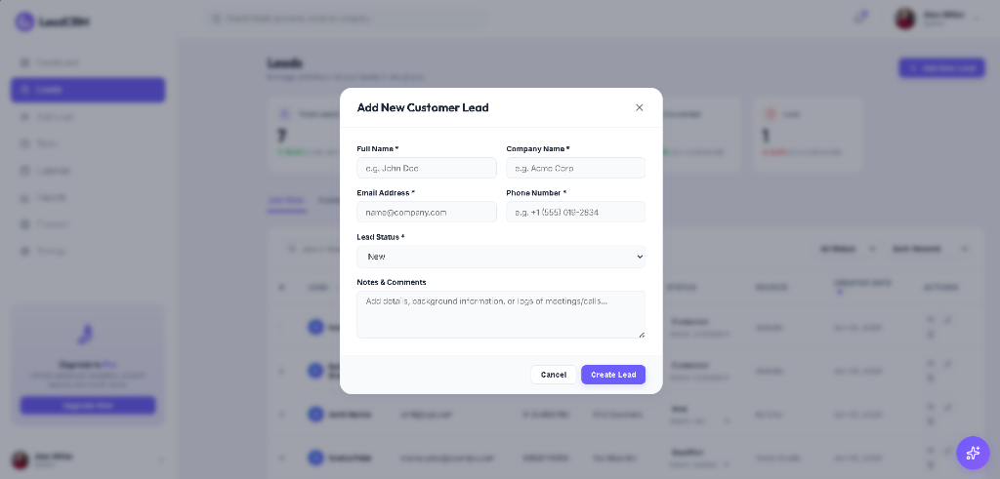

# LeadCRM — Premium Lead Management CRM & AI Sales Assistant

LeadCRM is a sleek, modern, and highly interactive Full-Stack Customer Relationship Management (CRM) platform built for small businesses to track, qualify, and convert potential customers. It integrates **Google Gemini AI** to provide automated lead scoring, text summarization, smart call-note builders, and a floating chatbot to query your pipeline.

---

## 🎨 Interface & Screenshots

### 1. Interactive Dashboard
The central control panel with visual KPI summaries, live donut charts of lead statuses, a 30-day leads graph, conversion rate metrics, and recent activity logs.


### 2. Leads Management
A clean table interface supporting search queries, pagination, inline status selectors, sorting, and tab switches for list views, Kanban boards, and source channels.


### 3. Add & Edit Lead Modal
A pop-up form to capture lead fields. For existing leads, it renders the "✨ AI Assistant Insights" panel to score conversion probability and summarize notes.


### 4. Tasks Manager
A Kanban-style todo list to schedule follow-ups, set priorities, and track productivity metrics across calendar dates.


### 5. Calendar Scheduler
A monthly planner to add and view scheduled meetings, calls, and proposals linked to specific day, month, and year values.


### 6. Reports & Analytics
A comprehensive metrics page displaying conversion statistics, top performing sales representatives, lead acquisition channels (Website, Referrals, Social Media, Campaigns), and a 30-day Leads Over Time chart.

### 7. Contacts Directory
A direct contacts list showing names, companies, and starred items, with interactive call (`tel:`) and email (`mailto:`) links to reach customers instantly.

---

## ⚙️ How It Works (Under the Hood)

1. **Frontend Architecture (React + Vite)**:
   - Built on React 18, the UI is styled with Vanilla CSS using modern styling standards (contrast backgrounds, royal purple gradients, rounded cards, and clean transitions).
   - Navigation is handled through tab states in `App.jsx`, ensuring fluid page loads without browser refreshes.
   
2. **Backend Services (Express + Node.js)**:
   - A modular MVC-style server running on Express.
   - All CRUD actions for Leads, Tasks, and Calendar Events are verified with Mongoose schema validation.
   - History logs and dashboard metrics are gathered using MongoDB aggregate pipelines (e.g., grouping by status, source channels, and lead creation dates for the past 30 days).

3. **Gemini AI Engine**:
   - The backend uses the official `@google/generative-ai` SDK.
   - When requested, the server sends lead metadata and call notes to the Gemini model (`gemini-1.5-flash`) to generate structured summaries, score conversion probability (0–100) with reasoning, and suggest sales follow-ups.
   - If a `GEMINI_API_KEY` is not present, the controller falls back to a high-fidelity **Demo AI mode** so all UI features, gauges, and note-copy actions remain testable.
   - The floating chatbot sends your prompt, chat history, and the entire leads database as context to answer pipeline questions.

4. **Real-time Notifications**:
   - Simulated background notifications have been removed in favor of real notifications.
   - Performing CRUD operations (saving leads, completing tasks, scheduling events, importing/exporting CSVs) triggers instant Toast popups and updates the notifications dropdown log.

---

## 📂 Project Structure

```
LeadCRM/
├── images/                  # Screenshot folder containing app views
│   ├── dashboard.png
│   ├── leads.png
│   ├── add_lead.png
│   ├── tasks.png
│   └── calendar.png
├── backend/                 # Node.js + Express backend
│   ├── config/              # Mongoose DB connection setup
│   ├── controllers/         # MVC controller queries (lead, event, task, AI)
│   ├── models/              # MongoDB Schema definitions (Lead, Event, Task, Activity)
│   ├── routes/              # Express Router endpoints (lead, event, task, AI)
│   ├── .env                 # Environment configuration (PORT, MONGODB_URI, GEMINI_API_KEY)
│   ├── seed.js              # Database populator script
│   └── server.js            # Express server entry point
├── frontend/                # Vite + React frontend
│   ├── public/              # Static assets
│   ├── src/                 # React source code
│   │   ├── assets/          # Icons, vectors
│   │   ├── components/      # UI Views (Dashboard, LeadsView, TasksView, CalendarView, ReportsView, ContactsView, SettingsView, LeadModal, AIChatWidget, AIPanel)
│   │   ├── utils/           # API fetch handlers
│   │   ├── App.jsx          # Root component and navigation state
│   │   ├── index.css        # Core design system and CSS styling
│   │   └── main.jsx         # App mounting entry point
│   ├── index.html           # HTML container
│   ├── package.json         # Dependency configuration
│   └── vite.config.js       # Vite build configuration
└── .gitignore               # Root git ignore patterns
```

---

## 🛠️ Step-by-Step Setup Guide

Follow these instructions to run the application from scratch on your local machine:

### Prerequisites
* **Node.js** (v18.x.x or higher) installed on your system.
* **MongoDB Community Server** installed and running on the default port `27017`.

---

### Step 1: Clone or Open the Project
Ensure the project is located on your local drive (e.g. `C:\Users\...\Desktop\leadpro`).

### Step 2: Configure Backend Environment
1. Open a terminal and navigate to the `backend` folder:
   ```bash
   cd backend
   ```
2. Install the backend dependencies (including Express, Mongoose, and Google AI SDK):
   ```bash
   npm install
   ```
3. Open or edit the `.env` file inside the `backend` folder and add your configuration:
   ```env
   PORT=5000
   MONGODB_URI=mongodb://localhost:27017/leadpro
   NODE_ENV=development
   GEMINI_API_KEY=your_actual_gemini_api_key_here
   ```
   *(If you leave `GEMINI_API_KEY` blank or write `your_key_here`, the app will automatically operate in **Demo AI Mode**).*

### Step 3: Seed the Database
Populate your MongoDB database with realistic sample leads, tasks, calendar events, and activity logs:
```bash
npm run seed
```

### Step 4: Run the Backend Server
Start the development server with Nodemon (restarts automatically on code changes):
```bash
npm run dev
```
The server will start on `http://localhost:5000` and output `MongoDB Connected: localhost`.

---

### Step 5: Configure & Start Frontend
1. Open a new, separate terminal and navigate to the `frontend` folder:
   ```bash
   cd ../frontend
   ```
2. Install the React and Vite dependencies:
   ```bash
   npm install
   ```
3. Start the Vite React development server:
   ```bash
   npm run dev
   ```
4. Navigate to the local server URL in your browser: **`http://localhost:5173/`**

Now, you can manage your CRM pipeline, view real-time charts, edit scheduler dates, and use your AI Sales Assistant!
